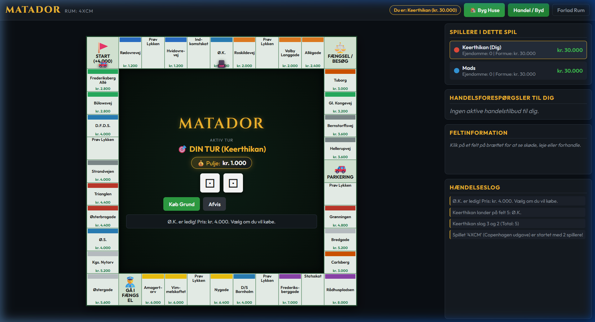
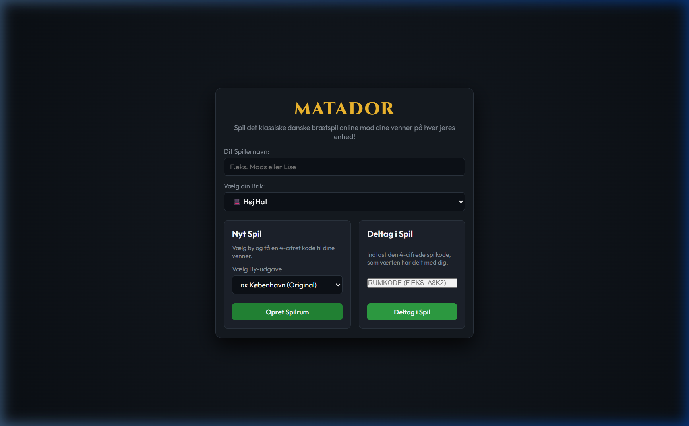
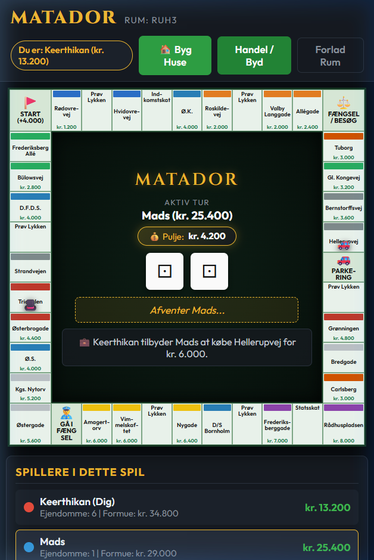
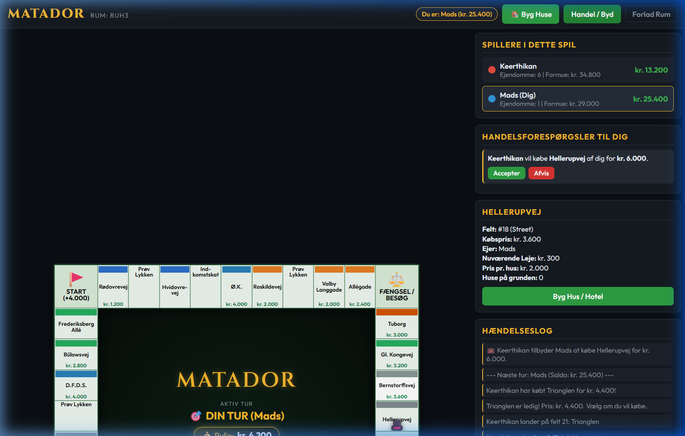
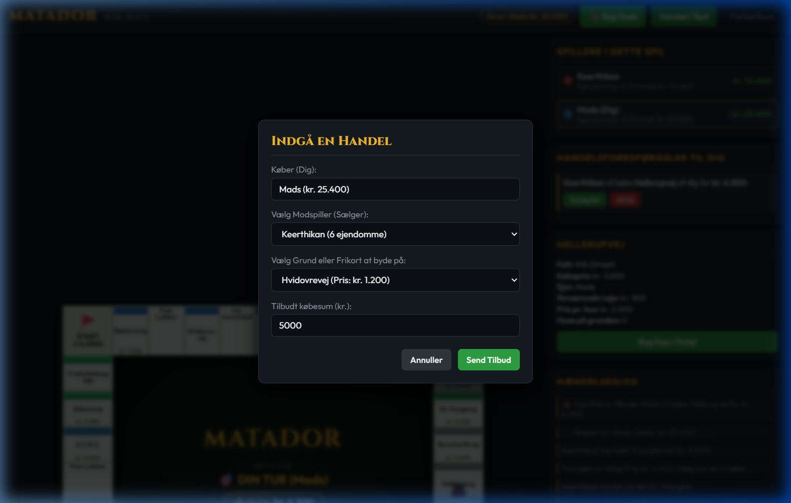
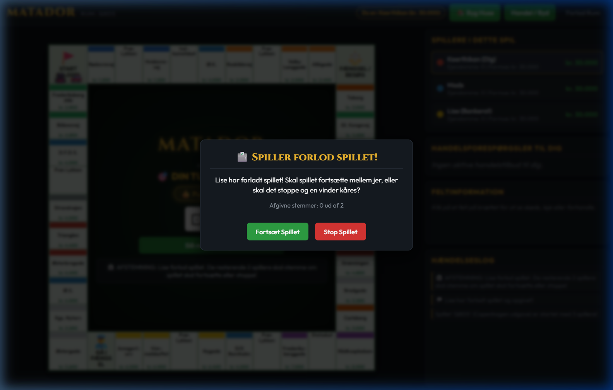

# Matador 🎲🇩🇰

En moderne .NET implementation af det klassiske danske brætspil **Matador**, komplet med en robust domænemotor, web-baseret multiplayer lobby og en interaktiv frontend.

---

## 📸 Screenshots

### Desktop & Multiplayer Gameplay
| 🎮 Spillebræt i Real-tid | 🏠 Multiplayer Lobby |
| :---: | :---: |
|  |  |

### Forhandling, Handel & Mobilvisning
| 📱 Responsiv Mobilvisning | 🤝 Forhandling & Handelstilbud | 💼 Afgiv Tilbud (Modal) |
| :---: | :---: | :---: |
|  |  |  |

### 🗳️ Forlad Spil & Afstemning
| 🗳️ Demokratisk Afstemning ved Forladt Spil |
| :---: |
|  |
| *Når en spiller forlader et igangværende spil, stemmer de resterende spillere i real-tid om spillet skal fortsætte eller stoppes.* |

---

## 🌟 Features

- **Matador.Core Engine & By-Udgave Temaer**:
  - Komplet spilmotor med 40 felter, farvegrupper, skøder, huse/hoteller, fængsel, skat og prøv lykken-kort.
  - **4 Danske Byer & Temaer**: Vælg frit imellem **København** (original), **Aarhus** (Smilets By), **Odense** (H.C. Andersens By med FynBus og Letbane) og **Aalborg** (Nordens Paris).
  - Korrekte transportmidler (færger ⛴️, busser 🚌, letbane 🚊) og lokale bryggerier 🍺 (Tuborg, Ceres, Albani, Carlsberg, Munkebo, Søgaards).
  - Håndtering af køb, leje, pantsætning, bankerot og jackpot-parkeringspulje.
  - Tjek af købeevne: Grundkøb tilbydes kun hvis spilleren reelt har råd.
- **Interaktivt Bræt & Visuelle Ejer-Markeringer**:
  - Dynamisk bevægelse af spillebrikker med uret rundt om pladens 4 ydersider.
  - Tydelig visualisering af ejerskab med diskret spillertoning af grundene og ejer-cirkler med spillerens brik og farve i øverste hjørne.
  - Asymmetrisk leje-opkrævning: Kreditor skal selv nå at opkræve lejen inden næste terningekast!
- **Multiplayer, Solo & AI Botter**:
  - Spil alene mod 1-5 intelligente computer-modstandere (f.eks. *Robot Mads*, *Onkel Joakim*, *Baron von Guld*).
  - AI'erne kaster terninger, køber grunde strategisk med budgetbuffer, bygger huse, betaler ud af fængsel, afgiver stemmer og evaluerer handelstilbud.
  - Opret eller deltag i spilrum via 4-cifrede koder med venner.
  - Vært/spiller-roller med sessionsstyring og mulighed for at tilføje/fjerne botter eller forlade spil.
- **Web App**:
  - Minimal API backend bygget på .NET 9/ASP.NET Core.
  - Servérbar frontend via wwwroot med real-time spilinteraktion.
- **Console Demo**:
  - Hurtig CLI-udgave til at afprøve regler og simulere runder.
- **Unit Tests**:
  - Testsuite i `Matador.Core.Tests` til validering af spillets forretningslogik og regler.

---

## 🏗️ Projektstruktur

```plaintext
Matador/
├── src/
│   ├── Matador.Core/          # Domænemodel, regler, terninger, felter og spilmotor
│   ├── Matador.Web/           # ASP.NET Core API + statisk Web UI (wwwroot)
│   └── Matador.ConsoleDemo/   # Simpelt konsol-interface til demo og test
├── tests/
│   └── Matador.Core.Tests/    # Enhedstests til test af regler og motoren
├── infra/                     # Infrastruktur og deploymentscripts
└── Matador.slnx               # Løsningsfil
```

---

## 🚀 Kom i gang

### Forudsætninger
- [.NET 9.0 SDK](https://dotnet.microsoft.com/download) eller nyere

### Kør Web Applikationen

1. Naviger til Web-projektet:
   ```bash
   cd src/Matador.Web
   ```

2. Start applikationen:
   ```bash
   dotnet run
   ```

3. Åbn browseren på den angivne URL (typisk `http://localhost:5000` eller `https://localhost:5001`).

### Kør Konsol Demoen

```bash
dotnet run --project src/Matador.ConsoleDemo
```

### Kør Tests

```bash
dotnet test
```

---

## 📄 Licens

Dette projekt er til personlig/uddannelsesmæssig brug.
